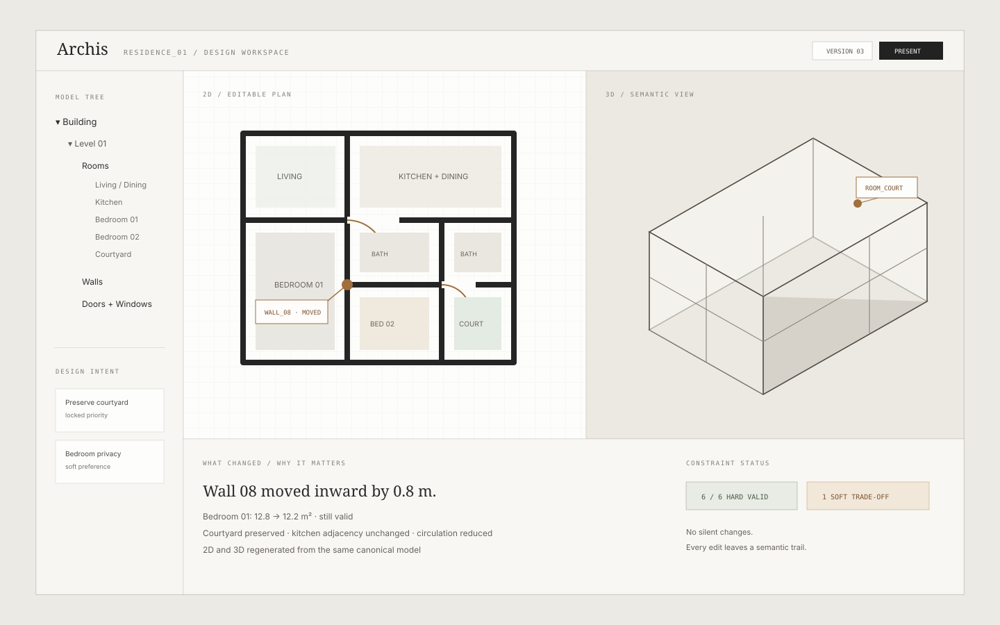
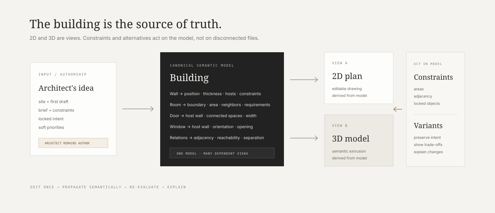

<p align="center">
  
</p>

# Archis

> **A semantic architecture workspace that starts from the architect’s first idea, not from a blank AI prompt.**

Archis explores one question:

**What if a building existed as one connected semantic object, and the floor plan, 3D model, constraints, and design alternatives were simply different ways of working with that same thing?**

The architect still makes the first move. Archis is meant to understand enough of the building around that move to keep the rest of the design coherent.

<p>
  
  
  
  
  
</p>

---

## The 20-second version

Traditional architecture workflows often make the same building exist in several representations at once: drawings, models, schedules, notes, constraints, exports, revisions.

Archis tries to move the source of truth underneath those representations.

```text
Architect's first draft
        +
site + requirements + constraints + intent
        ↓
CANONICAL SEMANTIC BUILDING MODEL
        ↓
┌──────────────┬──────────────┬──────────────┐
│   2D plan    │   3D view    │ constraints  │
└──────────────┴──────────────┴──────────────┘
        ↓
change propagation + nearby alternatives + explanations
        ↓
architect accepts, edits, rejects, or refines
```

**2D and 3D do not synchronize directly with each other. They both read from the same model.**

That is the core architectural decision behind the project.

---

## What exists today

Archis now has a small working MVP focused on proving the semantic interaction rather than pretending to be a full BIM platform.

### Current prototype

- interactive 2D room-plan workspace
- linked 3D semantic extrusion
- shared semantic model stored independently of either view
- live hard-constraint evaluation
- bedroom minimum-area checks
- kitchen ↔ living adjacency check
- substantial-overlap detection
- deterministic design variants
- semantic explanation / status UI
- Zustand-backed shared state

### Deterministic variants currently implemented

- **Preserve** — snaps the base design while preserving the layout structure
- **More Private** — pushes bedrooms / bathroom away from the more public zone and extends circulation
- **More Compact** — reduces selected room and circulation dimensions while keeping bedroom minima above their hard thresholds

The point is deliberately **not** “AI magically generates architecture.”

The current prototype first proves that geometry, relationships, constraints, and views can stay attached to one canonical building representation.

---

## Product workspace concept

<p align="center">
  
</p>

The interface direction follows the same rule as the engine: make the building feel like one object being inspected from several angles, not several files awkwardly trying to agree.

The workspace is intentionally quiet: drafting-grid surfaces, architectural neutrals, semantic highlights, and explanations that sit beside the design instead of drowning it in dashboard chrome.

> The visual above is a **product-direction mockup**, not a claim that every shown control is implemented exactly as pictured.

---

## Why Archis exists

Architectural design is not just “generate a floor plan from a prompt.”

An architect begins with much more than a room list:

- site dimensions, orientation and access
- setbacks and regulations
- client requirements
- room relationships and circulation
- privacy, daylight and ventilation priorities
- budget and material constraints
- elements that should not move
- and, most importantly, **design intent**

The first sketch already contains part of that intent.

Archis starts there.

Instead of asking AI to replace the architect, the system is designed around the architect producing the first concept and then working with software that can understand, test, compare, and explore **nearby** variations without forgetting what the design was trying to be.

---

## The semantic core

A normal drawing primitive might be:

```text
line from (x1, y1) to (x2, y2)
```

Archis wants to work closer to:

```text
Wall
├── identity
├── position
├── thickness
├── height
├── material
├── adjacent spaces
├── hosted openings
└── constraints
```

A room similarly becomes more than a polygon:

```text
Room
├── name / type
├── boundary
├── area
├── neighboring spaces
├── openings
├── minimum requirements
├── privacy / access rules
└── design priorities
```

<p align="center">
  
</p>

This canonical model is the thing Archis edits.

The 2D plan and 3D representation are dependent views of that model, not competing sources of truth.

---

## What happens when something changes?

Suppose an architect moves a wall.

Archis should not merely move pixels.

```text
Move wall
   ↓
room boundaries change
   ↓
areas change
   ↓
adjacencies may change
   ↓
hosted openings may be affected
   ↓
constraints re-evaluate
   ↓
2D + 3D views update from the model
   ↓
trade-offs are surfaced
```

That idea, **semantic change propagation**, is the part of Archis that matters most.

A design tool becomes much more useful when it understands that one edit has consequences elsewhere and can tell the architect what those consequences are.

---

## Architect first, AI second

Archis is not intended to become:

> “Describe a house and AI designs everything for you.”

That flattens one of the most interesting parts of architecture: judgment.

The intended interaction is closer to:

1. the architect creates the first concept,
2. Archis represents the design as structured building objects,
3. explicit constraints and priorities attach to that model,
4. the system explores nearby alternatives,
5. trade-offs are exposed,
6. the architect decides what is worth keeping.

AI may eventually help interpret intent, explain failures, suggest possible adjustments, or rank alternatives.

But **geometry, constraints, and validity should not depend on an LLM hallucinating a building into existence.**

---

## Example design brief

### Hard constraints

```text
Bedroom 1 area >= 12 m²
Bedroom 2 area >= 10 m²
Kitchen remains adjacent to living/dining
Locked objects remain fixed
Rooms must not substantially overlap
```

### Softer intent

```text
Keep bedrooms more private than social spaces
Preserve the courtyard as a visual center
Prefer better daylight in the living room
Avoid unnecessary circulation
Do not destroy the original spatial organization
```

Archis can then explore nearby versions such as:

- **Preserve Original** — resolve or normalize without redesigning the concept
- **More Private** — increase separation between sleeping and public zones
- **More Compact** — reduce unnecessary footprint while protecting hard constraints

The useful output is not just another floor plan. It is the explanation around the change:

```text
Bedroom wing shifted away from the public zone.
Kitchen-living adjacency preserved.
Bedroom minima remain valid.
Circulation increased to preserve reachability.
```

There is no single mathematically perfect house.

The product should make trade-offs visible enough that the architect can make the actual decision.

---

## Architecture

```text
┌─────────────────────────────────────────┐
│                UI / VIEWS               │
│        2D Editor       3D Viewer        │
└───────────────────┬─────────────────────┘
                    │
                    ▼
┌─────────────────────────────────────────┐
│        CANONICAL SEMANTIC MODEL         │
│      rooms • relations • geometry       │
└───────────────────┬─────────────────────┘
                    │
          ┌─────────┴──────────┐
          ▼                    ▼
┌──────────────────┐  ┌──────────────────┐
│ Constraint Engine│  │ Variant Explorer │
└──────────────────┘  └──────────────────┘
          │                    │
          └─────────┬──────────┘
                    ▼
          semantic explanations
```

### Current stack

| Layer | Current choice |
| --- | --- |
| App | React 18 + TypeScript |
| Build | Vite 5 |
| Styling | Tailwind CSS |
| 3D | Three.js + React Three Fiber + Drei |
| State | Zustand |
| Icons | Lucide React |
| Constraint logic | deterministic TypeScript engine |
| Variant generation | deterministic transformations over the semantic model |

---

## What Archis is *not* claiming

Existing BIM and architecture software already supports semantic building objects, coordinated drawings, 2D/3D workflows, and increasingly AI-assisted design.

So Archis is **not** built on claims like:

- “nobody has connected 2D and 3D before”
- “semantic building objects do not exist”
- “BIM is broken and this replaces all of it”
- “AI should design buildings instead of architects”

The hypothesis is narrower:

> **Can software begin from an architect’s own first concept, preserve enough of its intent to matter, and help explore better nearby versions without flattening the design into generic optimization?**

That is what the prototype is meant to test.

---

## Why the architect still matters

Archis can know whether a bedroom dropped below 12 m².

It can know that a kitchen and living room are no longer adjacent.

It can know that two spaces overlap.

But architectural judgment includes things much harder to formalize:

- what a space should feel like
- what deserves emphasis
- which trade-off is acceptable
- how a sequence of spaces should unfold
- which imperfection gives a design character
- what a particular client means when they describe how they want to live

That is why the architect gives the first draft.

The draft is not merely geometry. It is evidence of intent.

Archis should help the architect **push that idea further**, not erase the reason an architect was there in the first place.

---

## Current status

**Stage:** active MVP / semantic interaction prototype

The repository now contains a working front-end prototype rather than only the original concept document.

### What the MVP is trying to prove

1. one semantic model can drive both 2D and 3D representations,
2. deterministic constraints can react immediately to edits,
3. alternatives can be generated as transformations of the same design rather than unrelated new layouts,
4. the system can surface *why* an edit matters,
5. the architect can remain in control of the design loop.

### What it does **not** prove yet

- architectural quality in real practice
- robust arbitrary floor-plan parsing
- structural validity
- MEP coordination
- comprehensive code compliance
- BIM / IFC interoperability
- production-grade geometry
- whether architects actually prefer this workflow

Those are later validation problems, not things this prototype should pretend are solved.

---

## Roadmap

### Phase 0 — semantic interaction ✅ / in progress

- [x] shared model
- [x] editable 2D representation
- [x] linked 3D view
- [x] hard constraints
- [x] deterministic alternatives
- [x] semantic explanation UI
- [ ] tighten edit propagation around more entity types
- [ ] improve room / wall semantics beyond the current simplified prototype

### Phase 1 — test usefulness with architects

- real residential briefs
- workflow observation
- structured feedback on change explanations
- test which parts of “design intent” architects actually want preserved
- measure whether semantic propagation reduces repetitive iteration

### Phase 2 — deepen the engine

- walls, doors and windows as richer first-class entities
- stronger topology and reachability
- semantic undo / redo transactions
- dependency-aware recomputation
- richer constraints
- explicit hard vs soft priorities

### Phase 3 — earn the AI layer

- natural-language intent interpretation
- explainable alternative ranking
- broader design-search strategies
- design-history / decision traces

### Phase 4 — interoperability

- BIM / IFC handoff
- collaboration and versioning
- professional pilot projects
- deeper cost / compliance / digital-twin directions only where the core model justifies them

---

## Why this project exists

Archis comes from a very ordinary frustration: architecture work becomes fragmented frighteningly quickly.

The interesting technical problem is not “can a browser render a room in 3D?”

It is whether software can understand enough of a building that editing, checking, comparing, and iterating feels like working with **one coherent thing**.

That is what I am testing here.

---

## One sentence

**Archis starts with the architect’s first idea and lets 2D, 3D, constraints, and alternatives evolve around one shared semantic building model instead of repeatedly rebuilding the same design across disconnected representations.**

---

<sub>Archis is an active prototype. The visuals in this README include product-direction mockups alongside implemented concepts; future sections describe direction, not completed professional BIM functionality.</sub>
