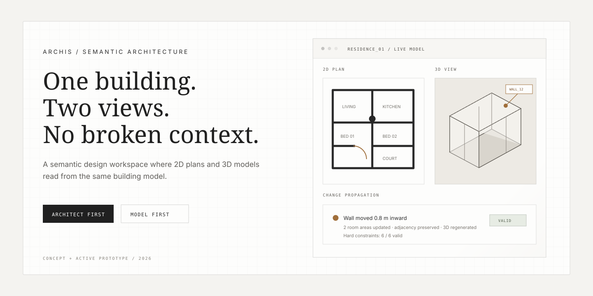

<p align="center">
  
</p>

# Archis

> **The architect authors the design. Archis helps the design survive change.**

Archis is an architect-first design product for continuing and revising an existing design without losing the reasoning embedded in it.

The core idea is simple:

> **A building should remain one semantic, versioned project state as it changes. AI can interpret, propose, rank, and explain changes, but the architect remains authoritative.**

Archis is not trying to win by generating more floor plans from scratch. It starts from the architect's own partial design and focuses on what happens **after the first meaningful design exists**.

---

## The product loop

```text
ARCHITECT'S DESIGN
        ↓
canonical semantic building state
        ↓
linked 2D + 3D + constraints + project context
        ↓
architect edits OR requests a change
        ↓
small reviewable patch / candidate
        ↓
geometry + constraint validation
        ↓
semantic impact explanation
        ↓
accept / edit / reject / revert
        ↓
new project version
```

The long-term goal is not “AI designs the building.”

It is:

> **software that can continue the architect's own design without casually flattening the decisions that made it theirs.**

---

## Why Archis exists

A design is rarely finished after its first draft.

Clients change requirements. Rooms grow. Circulation moves. Site information arrives. Constraints appear. A wall shift propagates into openings, adjacency, privacy, area, and downstream decisions.

Traditional tools are very good at representing geometry and increasingly good at generation.

The harder problem is continuity:

```text
What changed?
What broke?
What survived?
What did the architect care about preserving?
Which alternative disturbs the existing design least?
```

Archis is being built around that revision loop.

---

## Product thesis

**Continue the architect's own partial design as a semantic, versioned, AI-editable building state, then make later changes as small, reviewable patches rather than replacing the design with a new generated answer.**

That product thesis does **not** depend on solving perfect intent inference.

Even before the research layer matures, a useful Archis can provide:

- one canonical semantic design state,
- linked 2D and 3D representations,
- deterministic constraints,
- structured revision impact,
- reviewable changes,
- project history,
- persistence,
- export / handoff.

Intent inference makes that loop more powerful. It is a research wedge, not the only reason the product can exist.

---

## The research wedge

An architect-authored plan contains more than explicit constraints.

Some relationships are deliberate:

- a courtyard anchors social spaces,
- bedrooms are screened from the entrance,
- kitchen and dining form a strong pair,
- a circulation sequence is intentional.

Other geometry is incidental.

Archis is testing whether software can infer likely design intent **without pretending certainty**, let the architect correct those hypotheses, and use the confirmed project knowledge during later revisions.

```text
observed design
      ↓
intent hypothesis + confidence + evidence
      ↓
architect: protect / prefer / incidental / edit
      ↓
confirmed project intent
      ↓
revision candidate
      ↓
"what changed / what survived / what weakened"
```

Read the full [research thesis](docs/research/RESEARCH_THESIS.md).

---

## What Archis is not

Archis is not:

- a prompt-to-building generator,
- an autonomous “AI architect,”
- a rendering-first app,
- a consumer room-planning tool,
- a Revit clone,
- a universal structural/MEP/code solver,
- an LLM wrapper that directly mutates geometry,
- a pile of disconnected AI features.

The building state, not an AI response, is the source of truth.

---

## What exists today

The current repository is a working React/TypeScript web prototype.

### Design state and editing

- shared semantic model used by 2D and 3D
- editable 2D plan workspace
- linked Three.js / React Three Fiber 3D view
- geometry graph work with walls/vertices
- blueprint overlay and calibration
- manual space editing
- deterministic constraint evaluation
- deterministic variants

### Revision / intent scaffolding

- first-class `IntentHypothesis` model
- deterministic intent hypotheses for the current demo state
- Intent Inspector with architect decisions
- change-request explorer for a constrained revision case
- semantic change-impact logic
- candidate comparison scaffolding

These are real product primitives, but the current intent inference and semantic-distance logic are **heuristic/provisional**, not validated research results.

### AI / persistence / export

- server-side Gemini blueprint extraction endpoint
- Gemini recommendation endpoint
- Firebase authentication
- Firestore project persistence
- SVG export
- GLTF export

### Current stack

| Layer | Choice |
| --- | --- |
| App | React 18 + TypeScript |
| Build | Vite |
| State | Zustand |
| 3D | Three.js + React Three Fiber + Drei |
| Styling | Tailwind CSS |
| Persistence | Firebase / Firestore |
| AI endpoints | Vercel serverless functions + Gemini |
| Geometry / constraints | deterministic TypeScript |

---

## Architecture rule

**One project state. Many views.**

```text
                ┌───────────────┐
                │  2D workspace │
                └───────┬───────┘
                        │
┌───────────────┐       ▼       ┌───────────────┐
│ AI / imports  │ → CANONICAL ← │   3D viewer   │
└───────────────┘   BUILDING     └───────────────┘
                    STATE
                      │
          ┌───────────┼───────────┐
          ▼           ▼           ▼
     constraints    intent      versions
          │           │           │
          └───────────┼───────────┘
                      ▼
               reviewable patch
                      │
                      ▼
                 impact report
```

AI may propose an operation.

Deterministic geometry and constraint systems validate it.

The architect decides whether it becomes the next project state.

Read the [technical architecture](docs/engineering/TECHNICAL_ARCHITECTURE.md).

---

## Why not just BIM?

BIM already solved fundamental representation problems that Archis depends on:

- semantic building objects,
- coordinated views,
- parametric relationships,
- professional documentation.

Archis does not claim otherwise.

The initial product wedge is the **early revision / design-continuity layer** around an existing authored design.

A plausible professional workflow is:

```text
existing sketch / CAD / BIM concept
        ↓
Archis semantic continuation + revision reasoning
        ↓
architect-approved state
        ↓
existing professional delivery workflow
```

If users ultimately want the engine inside an incumbent authoring tool, Archis can become an integration rather than forcing migration.

---

## Competitive reality

Archis is being developed in a crowded field.

Snaptrude, Finch, Autodesk Forma/Revit, Archicad, Rhino/Grasshopper, TestFit, Hypar, and recent academic floor-plan systems already cover important parts of semantic design, generation, constraints, editing, and AI-assisted architecture.

Therefore these are not defensible claims by themselves:

- “AI for architects”
- “one model behind 2D and 3D”
- “design intent”
- “constraint-aware generation”
- “natural-language CAD”
- “editable AI floor plans”

The remaining wedge has to be earned around:

- architect-authored project continuity,
- project-specific intent,
- uncertainty + provenance,
- reviewable local changes,
- versioned decision memory,
- professional interoperability.

Read the [competitive landscape](docs/research/COMPETITIVE_LANDSCAPE.md).

---

## Validation

The next proof is not another shiny feature.

It is real architects using Archis on real revision work.

We want to measure:

- where revision work currently gets rebuilt or reconciled,
- which relationships architects actually care about preserving,
- how much correction Archis requires,
- whether reviewable patches reduce effort,
- which suggestions are accepted / edited / rejected,
- whether users return with another revision or project,
- where they abandon Archis and return to existing tools.

A first demo is not validation.

**Repeated use is.**

Read the [validation plan](docs/research/VALIDATION_PLAN.md).

---

## Product direction

The current implementation is a web prototype.

The professional product direction is toward a stronger, more private and portable architecture workflow with:

- canonical project state,
- explicit versioning,
- reviewable/reversible changes,
- local/offline capability where valuable,
- provider-independent AI boundaries,
- stronger CAD/BIM interoperability,
- collaboration built on top of project history rather than ad-hoc state.

The team should extend the same product model rather than creating parallel mini-products.

Read [Product Direction](docs/PRODUCT_DIRECTION.md).

---

## Working on Archis

Start with:

- [Contributing](CONTRIBUTING.md)
- [Product Direction](docs/PRODUCT_DIRECTION.md)
- [Technical Architecture](docs/engineering/TECHNICAL_ARCHITECTURE.md)
- [Research Thesis](docs/research/RESEARCH_THESIS.md)
- [Validation Plan](docs/research/VALIDATION_PLAN.md)

### Local development

```bash
npm ci
npm run dev
```

### Production build

```bash
npm run build
```

Pull requests are expected to pass CI before merging.

---

## One sentence

**Archis keeps an architect's design as one evolving semantic project state and helps change it without unnecessarily losing the decisions that made the original design work.**

<sub>Current implementation, heuristic prototypes, research hypotheses, and validated claims are intentionally kept separate.</sub>
